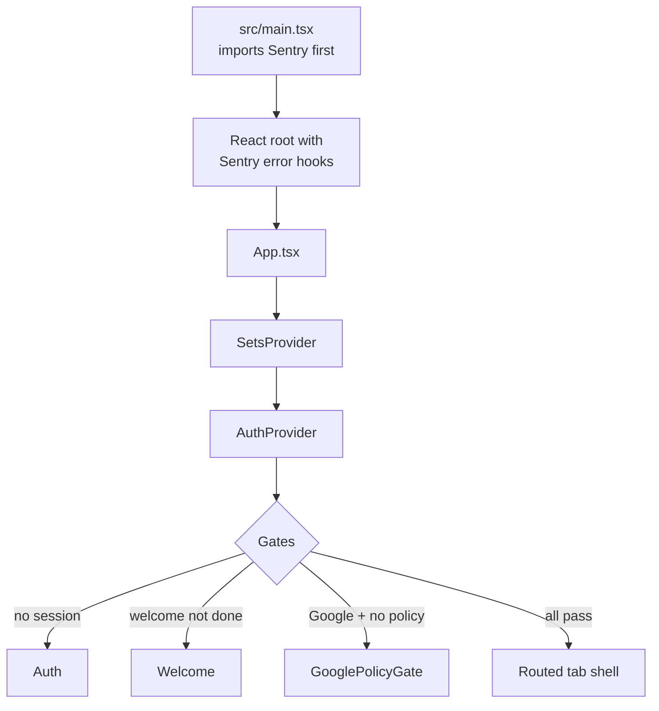

# The app is a React 19 + Supabase + Capacitor training log

iSkiLog is a single-page React 19 app that logs and analyzes tournament-style **waterski practice**. It ships as a browser SPA and as a Capacitor-wrapped Android app. There is **no custom backend** — [[supabase-provides-auth-postgres-and-rpc|Supabase]] is the entire backend (Auth + Postgres + RPC).

## The one domain object: a set

Everything orbits a **set** = one logged training pass. A set has shared base fields (event type, date, optional time of day, season id, favourite flag, [[notes-are-stored-as-six-structured-sections|structured notes]]) plus event-specific subtype data for **slalom / tricks / jump / other**. In TypeScript this is modeled as [[a-set-is-a-discriminated-union-narrow-by-event|a discriminated union]].

## Startup flow

1. `src/main.tsx` imports [[sentry-captures-handled-and-unhandled-errors|Sentry instrumentation]] **first**.
2. React root is created with Sentry React 19 error hooks.
3. `App.tsx` wraps everything in [[state-lives-in-a-reducer-based-setsstore|SetsProvider]] then [[hydration-is-centralized-in-authprovider|AuthProvider]].
4. `AuthProvider` resolves auth and hydrates all user data.
5. Routing + tab shell render only after hydration and onboarding gates pass.

## Two-layer mental model

When debugging data problems, always think in two layers:

1. **Frontend** — shape + optimistic state behavior (in `src/`)
2. **Supabase** — RPC, RLS policy, SQL behavior

## Related

- [[the-stack-is-react19-vite-supabase-capacitor]]
- [[the-database-is-postgres-with-rls-and-subtype-tables]]
- [[deployment-targets-web-spa-and-android]]
- Business framing: [[iskilog-serves-tournament-style-waterski-skiers]]
