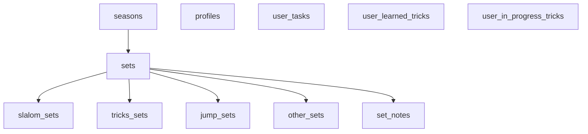

# The database is Postgres with RLS and subtype tables

Schema source of truth: [`tests/e2e/db/schema.sql`](../../../tests/e2e/db/schema.sql). Trust it over any prose.

## Shape: one base table + per-event subtype tables

A `sets` row holds the shared base; each event family has its own subtype table keyed by `set_id`. Notes live in their own table too ([[notes-are-stored-as-six-structured-sections]]).

## Tables

| Table | Holds |
|---|---|
| `profiles` | `full_name` per user |
| `seasons` | calendar-year seasons ([[seasons-are-calendar-year-only]]); `is_active` flag |
| `sets` | base: `event_type` (checked enum), `date`, **nullable `time_of_day`**, `is_favorite`, `season_id`, timestamps |
| `set_notes` | six text sections, `UNIQUE(set_id)` → enables upsert |
| `slalom_sets` | buoys, rope_length, speed, passes_count |
| `tricks_sets` | duration_minutes, trick_type |
| `jump_sets` | subevent, attempts, passed, made, distance, cuts_type, cuts_count |
| `other_sets` | name, duration_minutes |
| `user_tasks` | title (1–140 chars), due_date, is_done, completed_at |
| `user_learned_tricks` / `user_in_progress_tricks` | `(user_id, trick_id)` PK |

> [!important] No freeform notes column on `sets`
> `sets` has **no** `notes` column. Structured notes were extracted into `set_notes`. See [[notes-are-stored-as-six-structured-sections]].

## Row-Level Security everywhere

Every table has RLS policies. User-owned tables scope by `auth.uid() = user_id`. Subtype + `set_notes` tables scope **indirectly** via an `EXISTS` check against the parent `sets` row's `user_id`. The app assumes RLS is on and rows are correctly scoped.

## Access via RPC, not raw writes

Set create/update goes through transactional RPCs so the base row, subtype row, and `set_notes` stay consistent — see [[set-crud-must-go-through-rpcs]]. `fetch_sets_hydrated` joins everything into one hydrated row shape.

## Related
- [[the-app-is-a-react19-supabase-capacitor-training-log]]
- [[supabase-provides-auth-postgres-and-rpc]]
- [[subtype-rpc-payloads-are-shaped-in-one-place]]
