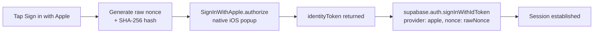

# Apple Sign In uses native SDK and signInWithIdToken

Apple Sign In is configured for native iOS using the bundle ID (`com.damir.iskilog`), not a web Service ID. The flow is entirely in-process — no browser, no deep link.

## Native iOS flow

1. A random **raw nonce** is generated in JS.
2. Its **SHA-256 hash** is sent to Apple via `SignInWithApple.authorize()` (plugin: `@capacitor-community/apple-sign-in@7.1.0`).
3. Apple returns an `identityToken` (JWT).
4. `supabase.auth.signInWithIdToken({ provider: "apple", token: identityToken, nonce: rawNonce })` exchanges it for a Supabase session.

The raw nonce round-trips through Apple's JWT so Supabase can verify the token was generated by this app session. **Never send the hashed nonce to Supabase — only the raw one.**

## Web / Android fallback

On web or Android, `supabase.auth.signInWithOAuth({ provider: "apple" })` is used instead — same redirect pattern as [[google-oauth-uses-capacitor-browser-and-deep-links|Google OAuth]]. Apple button is hidden on Android because native-only Supabase config (bundle ID only, no Service ID) won't work via browser OAuth.

## Name on first sign-in only

Apple provides `givenName` / `familyName` **only on the first sign-in**. `handleApple` in `src/pages/Auth.tsx` writes them directly to `profiles` after `signInWithIdToken` succeeds. `ensureProfileName` in [[hydration-is-centralized-in-authprovider|AuthProvider]] acts as a safety net for subsequent sign-ins but can't back-fill if Apple didn't provide the name.

## Entitlements

`ios/App/App/AppRelease.entitlements` carries `com.apple.developer.applesignin: [Default]`. This file must be wired to **both** Debug and Release build configs in `project.pbxproj` (`CODE_SIGN_ENTITLEMENTS = App/AppRelease.entitlements`). If missing from Debug, Apple Sign In fails silently during development.

## Policy gate

Apple-auth users must pass the same **policy acceptance gate** as Google users. `isAppleUser()` in `App.tsx` detects them via `app_metadata.provider === "apple"`.

## Related
- [[google-oauth-uses-capacitor-browser-and-deep-links]]
- [[hydration-is-centralized-in-authprovider]]
- [[supabase-provides-auth-postgres-and-rpc]]
