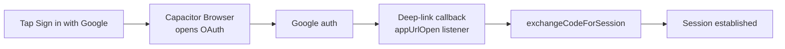

# Google OAuth uses Capacitor Browser and deep links

Google sign-in works on both web and native. Native is the tricky path.

## Native flow

1. Capacitor Browser opens the OAuth page.
2. Provider redirects back via a **deep link**.
3. `App.tsx` `CapacitorApp.addListener("appUrlOpen")` catches it.
4. `supabase.auth.exchangeCodeForSession()` completes sign-in.

Helpers: [`src/lib/nativeOAuth.ts`](../../../src/lib/nativeOAuth.ts).

## After OAuth sign-in
[[hydration-is-centralized-in-authprovider|AuthProvider]] sets `user_metadata` (e.g. `profile_name`) and backfills the profile `full_name` if missing.

## Policy gate for Google users

> [!note] Extra gate
> Google-auth users must pass the **policy acceptance** gate (`policy_accepted` metadata) on top of the welcome gate. See [[hydration-is-centralized-in-authprovider]].

## Related
- [[capacitor-wraps-the-app-for-android]]
- [[supabase-provides-auth-postgres-and-rpc]]
