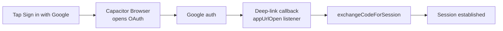

# Google OAuth uses Capacitor Browser and deep links

Google sign-in works on both web and native. Native is the tricky path.

## Native flow



1. Capacitor Browser opens the OAuth page.
2. Provider redirects back via a **deep link**.
3. `App.tsx` `CapacitorApp.addListener("appUrlOpen")` catches it.
4. `supabase.auth.exchangeCodeForSession()` completes sign-in.

Helpers: [`src/lib/nativeOAuth.ts`](../../../src/lib/nativeOAuth.ts).

The native redirect is the app's own URL scheme: `com.damir.iskilog://auth`.

## Each platform must register the deep-link scheme

The redirect `com.damir.iskilog://auth` only returns to the app if the OS knows that custom scheme belongs to this app. **This must be registered per-platform — there is no shared config.**

- **Android** — `intent-filter` in [`android/app/src/main/AndroidManifest.xml`](../../../android/app/src/main/AndroidManifest.xml):
  ```xml
  <data android:scheme="com.damir.iskilog" android:host="auth" />
  ```
- **iOS** — `CFBundleURLTypes` in [`ios/App/App/Info.plist`](../../../ios/App/App/Info.plist):
  ```xml
  <key>CFBundleURLTypes</key>
  <array>
    <dict>
      <key>CFBundleURLName</key><string>com.damir.iskilog</string>
      <key>CFBundleURLSchemes</key>
      <array><string>com.damir.iskilog</string></array>
    </dict>
  </array>
  ```

> [!warning] iOS symptom if missing
> If `CFBundleURLTypes` is absent, Google sign-in completes but the redirect back into the app fails. On retry iOS shows **"Safari cannot open the page because the address is invalid"** — its standard message for an unregistered custom URL scheme. The web flow is unaffected because it uses an `https://` redirect, not the custom scheme. `npx cap sync ios` does **not** regenerate `Info.plist`, so the entry must be added/kept manually.

> [!note] Supabase allow-list
> `com.damir.iskilog://auth` must also be listed under Supabase → Authentication → URL Configuration → Redirect URLs.

## After OAuth sign-in
[[hydration-is-centralized-in-authprovider|AuthProvider]] sets `user_metadata` (e.g. `profile_name`) and backfills the profile `full_name` if missing.

## Policy gate for OAuth users

> [!note] Extra gate
> Google **and Apple** auth users must pass the **policy acceptance** gate (`policy_accepted` metadata) on top of the welcome gate. `isGoogleUser()` and `isAppleUser()` in `App.tsx` detect them via `app_metadata.provider`. See [[hydration-is-centralized-in-authprovider]].

## Related
- [[capacitor-wraps-the-app-for-android]]
- [[supabase-provides-auth-postgres-and-rpc]]
